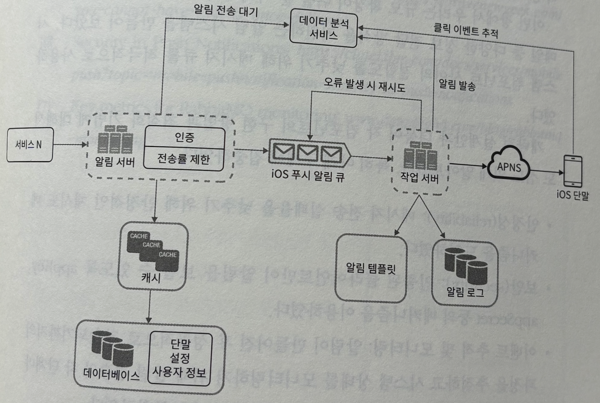

## 알림 시스템 설계

 

- 알림은 순서가 틀리거나 중복될 수 있지만, 누락되어서는 안 될 때도 있다. 따라서 알림 로그를 통해 모든 작업을 기록해 누락을 방지할 수 있다.

    - 알림 시스템에서 중복 알림은 현실적으로 막기 힘들다.
    
    > 분산 시스템에서 안정성을 높이기 위해 도입한 재시도 메커니즘이 오히려 중복의 원인이 될 수 있지 않을까?

    https://bravenewgeek.com/you-cannot-have-exactly-once-delivery/

    > 필자는 **현실적으로 '메시지의 단 한 번 전달'을 보장하는 것은 거의 불가능하고 비용이 매우 높으니, 그 대신 '최소 한 번 전달(At-least-once)'을 기반으로 소비자가 '멱등성(Idempotency)'을 갖추는 것이 훨씬 더 현실적이고 효율적인 해결책이다**라고 말하고 있다. 실제로 해당 작업이 단 '한 번 처리'되는 것이 목적이지, 메시지가 물리적으로 네트워크를 한 번 타는 게 중요한 게 아니다. 처리 결과에 집중해야 한다.

- 알림 시스템의 확장성을 높이기 위해 작업 별 여러 개의 큐를 사용한다.

- 알림 클릭 및 사용자의 행동은 유의미한 데이터이기 때문에, 알림 시스템은 대체로 데이터 분석 서비스와 연계되어야 한다.